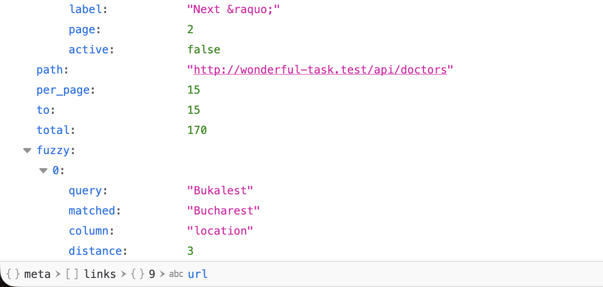

# MariaCare Doctor Search

A small Laravel service that lets MariaCare's voice agent look up doctors by name, clinic, location, county or speciality — and still find them when the speech-to-text layer mangles the words ("Bukalest" → Bucharest, "Dobert" → Robert).

- Endpoint: `GET /api/doctors`
- Data: a daily pull of the healthcare JSON export (7 029 doctors)
- Runtime: PHP + SQLite, no queue, no search server (see [DEPLOY.md](DEPLOY.md))

## How it works

```
JSON export ──▶ doctors:ingest (daily) ──▶ doctors table ──▶ GET /api/doctors
                 validate · swap · bust cache        │             │
                                                     └── FuzzyMatcher candidates (cached)
```

### 1. Ingest pipeline

`php artisan doctors:ingest` is the only write path. It runs daily at 03:00 via the scheduler (`routes/console.php`) and can be run by hand at any time.

1. **Fetch** — `GET` the URL in `DOCTORS_SOURCE_URL` (`config/doctors.php`). When no URL is set it reads the bundled `database/helthcate_data.json`, which is what local development and the test suite use.
2. **Validate** — every row is checked against per-column rules (`App\Services\DoctorIngest::rules()`): required strings, integer `years_experience`, `languages` as a list of strings, `rating` between 0 and 5, a well-formed `email`. Malformed rows are skipped and logged with their index and errors; the rest continue.
3. **Swap** — valid rows replace the table inside one transaction: delete, then insert in chunks of 500. Nothing is truncated up front, so a failed fetch, unparseable body, or a source with zero valid rows leaves yesterday's data untouched and exits non-zero.
4. **Bust cache** — only after the transaction commits, the `FuzzyMatcher` candidate cache is cleared so corrections reflect the new data.
5. **Summarise** — one log line and one console line: `Doctor ingest complete: imported 7029, skipped 0.`

`php artisan migrate --seed` calls the same command, so there is no separate seeder to drift out of sync.

### 2. Data model

One table, `doctors`, mirroring the JSON export column-for-column (`first_name`, `last_name`, `clinic_name`, `location`, `speciality`, `address`, `phone`, `email`, `postal_code`, `county`, `years_experience`, `education`, `languages` (JSON array), `availability`, `rating`). `location`, `speciality` and `county` are indexed.

**Assumption: there are no clinic entities.** The export has no clinic ids, addresses or opening hours of its own — `clinic_name` is just a string attribute on each doctor. It is therefore modelled as a filterable column, not a `clinics` table. If a clinic feed appears later, promote it to a model and a foreign key; the search API's `clinic_name` parameter can stay the same.

Column names follow the export's spelling (`speciality`, `county` — Romanian counties such as Cluj or Prahova) so the ingest is a straight map with no renaming layer.

### 3. Search flow

`GET /api/doctors` accepts, all optional:

| Param | Meaning | Example |
| --- | --- | --- |
| `q` | free text, matched against `first_name`, `last_name`, `clinic_name`, `location`, `speciality`, `county` | correct a misheard city: [`?q=Bukalest`](http://wonderful-task.test/api/doctors?q=Bukalest)<br>correct several words at once: [`?q=Popesku Bukalest`](http://wonderful-task.test/api/doctors?q=Popesku%20Bukalest) |
| `clinic_name`, `speciality`, `county`, `location` | exact, scoped filters (AND-ed with `q`), each corrected on its own column | filter by speciality and county: [`?speciality=Kardiology&county=Cluj`](http://wonderful-task.test/api/doctors?speciality=Kardiology&county=Cluj) |
| `per_page` (1–100, default 15), `page` | pagination | filter by clinic and paginate: [`?clinic_name=Clinica Brasov Care&per_page=5&page=2`](http://wonderful-task.test/api/doctors?clinic_name=Clinica%20Brasov%20Care&per_page=5&page=2) |

The example links target the local Herd host (`http://wonderful-task.test`); the same paths are also linked from the homepage.

Input is validated (`422` on bad values). Results are paginated and ordered by last name, first name, id. `App\Services\DoctorSearch` runs two tiers:

**Tier 1 — LIKE.** Scoped filters become `WHERE column = value`; `q` becomes an OR-ed `LIKE %q%` across the six text columns. If this returns rows, we're done and `meta.fuzzy` is `[]`.

**Tier 2 — Levenshtein fallback.** Only when tier 1 returns nothing for a non-empty `q`. `App\Services\FuzzyMatcher` compares the input against the distinct values of each searchable column (cached forever, busted by ingest and by model saves). Values are normalised first (ASCII-folded, lower-cased, whitespace squished) so diacritics and casing never count as edits. A candidate is accepted when

```
levenshtein(input, candidate) <= floor(max(len(input), len(candidate)) / 3)
```

i.e. roughly one edit per three characters, and inputs of three characters or fewer must match exactly. Ties are broken by `similar_text`; a tie on both distance and similarity between different values is treated as ambiguous and yields no correction.

For a multi-word `q`, the whole phrase is tried first ("Baya Mare" → "Baia Mare"), then each token: tokens already contained in some value are kept as `LIKE`, the others are corrected, and all tokens are AND-ed ("Dobert Bukalest" → Robert in Bucharest). Scoped filters are corrected the same way, per column ("Kardiology" → Cardiology).

Every correction that actually changed the input is reported so the agent can say "did you mean…". Corrections ride along in the standard paginated envelope: `meta.fuzzy` sits at the bottom of `meta`, after the usual `current_page` … `total` keys, so existing pagination consumers are unaffected.

```json
{
  "data": [ { "id": 1, "full_name": "Robert Ionescu", "location": "Bucharest", ... } ],
  "links": { ... },
  "meta": {
    "current_page": 1, "total": 1, ...,
    "fuzzy": [
      { "query": "Bukalest", "matched": "Bucharest", "column": "location", "distance": 3 }
    ]
  }
}
```

`meta.fuzzy` is always present: an empty list means the results are literal matches.

A real response for `GET /api/doctors?q=Bukalest` against the full dataset — 170 doctors in Bucharest, with the correction reported below the pagination fields:



## Running locally

```bash
composer run setup            # install, .env, key, migrate
php artisan doctors:ingest    # loads database/helthcate_data.json
curl 'http://wonderful-task.test/api/doctors?q=Bukalest'
./vendor/bin/pest --parallel
```

## Limitations and next steps

- **Ambiguous corrections return nothing by design.** When two values tie ("Marka" against Marta and Marca) the API returns zero results and no correction rather than guessing. The next step is to surface the tied candidates in `meta.fuzzy` as suggestions so the agent can ask the caller to pick one.
- **Levenshtein is per-column, in PHP.** The candidate set is small (20–42 distinct values per column in the current export) so this is fast, but it scales with the number of distinct values, not the number of rows. At real scale, Meilisearch via Laravel Scout is the drop-in replacement: it gives typo tolerance, ranking and prefix search natively, and `DoctorSearch` is the single seam to swap.
- **Whole-table swap.** Ingest replaces every row daily; ids are not stable across runs. If consumers need to store doctor ids, switch to an upsert keyed on a stable field (email or phone).
- **Single data source.** One JSON export, pulled once a day per the spec; there is no change feed or webhook.
